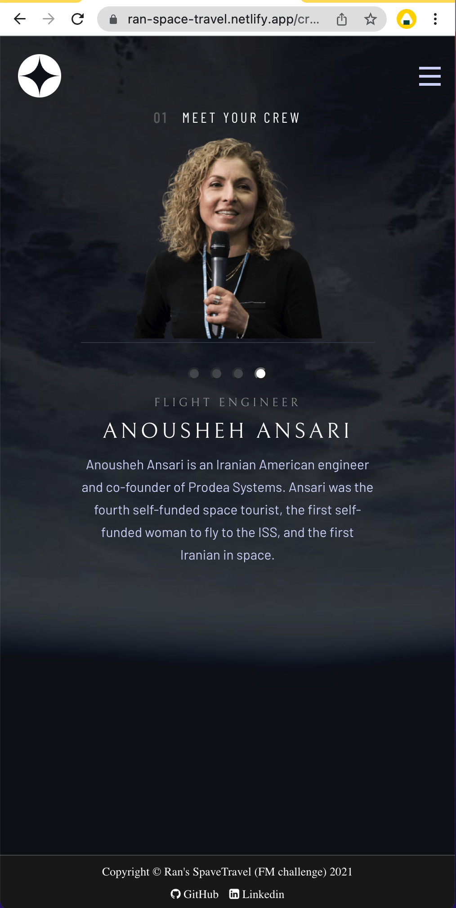

# Space Travel in React & Redux :eyes:

### Table of Contents

- [Description](#description)
- [Technologies](#technologies)
- [What I learned](#what-i-learned)
- [License](#license)
- [Author Info](#get-in-touch)

---

## Description

This is a solution to the [Space tourism website challenge on Frontend Mentor](https://www.frontendmentor.io/challenges/space-tourism-multipage-website-gRWj1URZ3). All code are original.

The app can be accessed at the link below.

> https://ran-space-travel.netlify.app/

---

## Technologies

- Frontend: React.js, React Router, JavaScript, HTML & CSS

---

## What I learned

- Identify reusable components and common CSS pattern: Crew, Destination and Technology page all have a control panel, a text panel and both of them sit inside a container. Extracting out resuable components minimises repetitive code

## License

MIT License

---

## Get in touch

  <a href="https://www.instagram.com/ranwren/">
    
@ranwren

    
  </a>
<a href="https://www.linkedin.com/in/ding-ran/">
  
@Ran Ding

    
  </a>

[Back To The Top](#)
